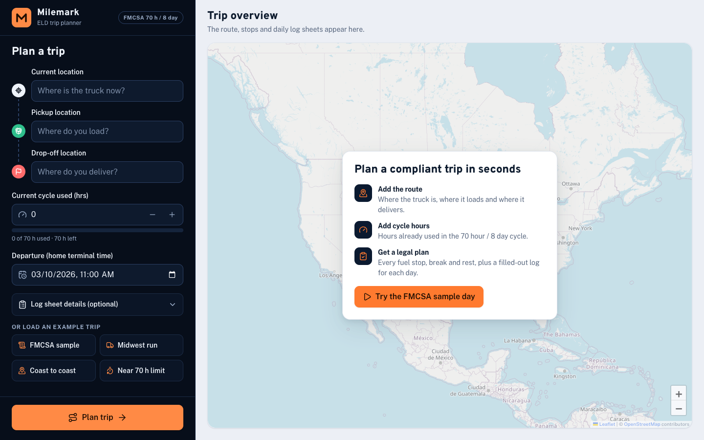
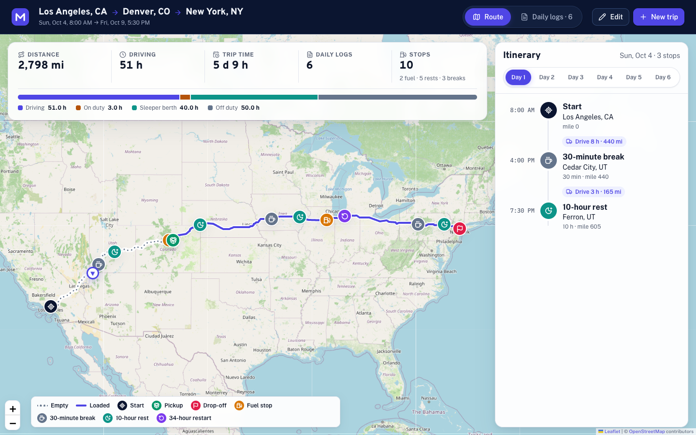
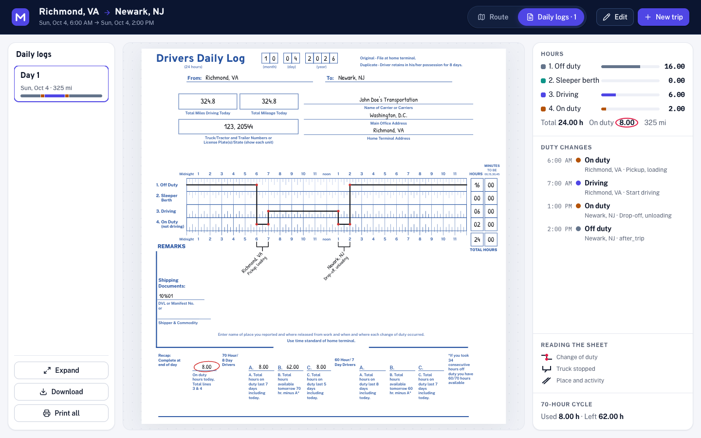
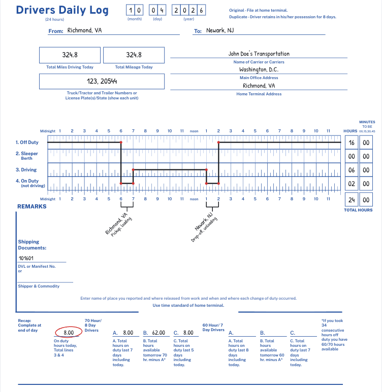

# Milemark: ELD trip planner

A full-stack app (Django REST + React) that takes a truck driver's trip details and returns the route with every required stop, plus filled-out FMCSA **Driver's Daily Log** sheets drawn from the plan.



## The problem

Inputs: current location, pickup location, drop-off location, and the hours already used in the driver's 70-hour / 8-day cycle.

Outputs:

1. A map showing the route and the stops and rests along it.
2. Daily log sheets, drawn and filled out like the paper form. Longer trips need several sheets.

Assumptions given with the assignment: property-carrying driver, 70 hr / 8 day cycle, no adverse driving conditions, fueling at least once every 1,000 miles, 1 hour for pickup and 1 hour for drop-off.

The hard part is that the log sheets are only correct if the schedule underneath them obeys the federal hours-of-service (HOS) rules in the *Interstate Truck Driver's Guide to Hours of Service* (FMCSA, April 2022), and the sheet itself has to match the paper form.

## The solution

1. **Route.** The backend geocodes the places, asks OSRM for the driving route (one request, three waypoints) and splits it into a deadhead leg (to pickup) and a loaded leg (to drop-off).
2. **HOS simulation.** A pure, deterministic simulation walks the route minute by minute and inserts every stop the rules require (table below).
3. **Log sheets.** The resulting duty segments are cut at midnight into calendar-day sheets. Each sheet gets totals that add up to 24 hours, remarks with the city and state of every change of duty status, miles for the day and the 70-hour recap.
4. **UI.** The trip is entered on a full-screen form first, then the results take over the full screen: the map with one side panel for the trip summary and a day-by-day itinerary, and the daily log sheets drawn as SVG replicas of the paper form supplied with the assignment. Sheets can be expanded, downloaded as PNG or printed (one sheet per page).





### How the log sheet follows the provided form

The sheet keeps every field of the blank *Drivers Daily Log* supplied with the assignment. It is drawn and filled the way a driver fills a paper log, following the FMCSA guide's "A Completed Log" (page 19) and the Schneider walkthrough *How to fill out a log book for truck drivers*:

- Printed form in blue, entries in black handwriting, like a real paper log.
- Header: the date in digit boxes (month / day / year), From and To, the two mileage boxes, the truck and trailer box, and the carrier, main office and home terminal lines.
- Grid: hour labels from Midnight to 11 across the top, repeated on a ruler under the grid. Each hour is split into 15-minute ticks, and there is one row per duty status.
- Pen line: a dot at every change of duty status, connected by horizontal and vertical lines.
- Line totals: HOURS and MINUTES boxes (00, 15, 30 or 45) for each line, plus a TOTAL HOURS row that always reads 24 00.
- Remarks: a bracket under the grid marks the time the truck did not move, and a 45° flag gives the city and state plus what the driver did ("Pickup, loading", "Fuel", "30 min break", "10 hr break (sleeper)", "34 hr restart", "Start driving"). Shipping documents sit bottom-left, and the instruction line sits in the gap of the bottom rule.
- Recap: on lines, as on the form. On-duty hours today (lines 3 and 4) are circled, as the walkthrough shows. A / B / C are filled for the 70 hour / 8 day driver; the 60 hour / 7 day columns stay blank.
- Next to the sheet, the app lists every change of duty in plain text, the hours per line, the recap, and a key explaining dots, brackets and flags.



### Interface design

- **Flow.** Enter the trip on one focused screen, watch it plan, then work with the results full screen. "Edit" opens the same form in a drawer over the results with every value kept and updates the plan in place (a failed update reopens the drawer with the message); "New trip" clears the plan and returns to the start screen with a clean form. If the planner cannot be reached, the message says so and offers "Try again".
- **Colour.** A road-sign palette: US guide-sign green for every action, signal amber for warnings, warm paper neutrals in light mode and asphalt greys in dark mode. Colour is otherwise reserved for meaning: driving green, on duty amber, sleeper blue, off duty stone; pickup violet, drop-off red. Headings use Overpass, a typeface derived from the US highway-sign alphabet. Light and dark mode follow the system and can be switched with the sun/moon button in the top-right corner.
- **Form.** The three places form a route timeline. Each node fills in as its place is entered, and the dotted connector between two filled places draws into a solid line. Optional log details open in a compact dialog (Escape or a click outside closes it), so the form never grows; the cycle field reads "0 of 70 h" with round +/- buttons and turns its hint amber near the limit; the screen fits the window without scrolling, down to small laptop heights.
- **Hero animation.** A top-down map: start at the top, pickup in the middle, drop-off at the bottom, joined by an S-shaped road (a narrower local road while empty, a highway with an amber centre line once loaded). One 12-second clock drives everything: a single top-down truck eases out of each stop and into the next, turning with the road; its trailer fills with cargo during the hour at the pickup and empties at the drop-off, while each stop card shows a progress bar and then a check. Beside the road, a "Daily log" card shows the current duty status (Off duty, Driving, On duty) and draws the matching line: off duty, driving, loading, driving, unloading, off duty.
- **Brand.** The logo is a truck driving on a road with a duty-log line on its trailer; the favicon matches.
- **Components.** Buttons, icon buttons with tooltips, the dialogs and edit drawer, alerts, text inputs and the departure date-time picker come from Mantine, themed with the palette above; the place search, cycle field, tabs and log sheet stay purpose-built. Text actions are pill-shaped; icon-only actions are round with a tooltip.
- **Map.** The map fits the route beside the side panel, draws the route in with an eased stroke (white casing, 4 px green core, dotted empty leg) over desaturated OpenStreetMap tiles (inverted for dark mode), pops in the stops, then replays the trip from the plan's own schedule: a top-down truck drives each leg, eases into every stop and waits there while a bubble shows what is happening (loading, fueling, 30-minute break, 10-hour rest, 34-hour restart, unloading) with a progress bar; the trailer fills with cargo at the pickup and empties at the drop-off, and the route behind the truck fills in as it goes. A replay card shows the day, trip clock, current activity and miles, with play/pause, 1×/2×/4× speed and a scrub slider, and the itinerary marks the live stop and follows its day.
- **Logs.** A toolbar with day tabs and round expand, download and print buttons, the sheet at the largest size that fits, and a side summary: hours per line, every change of duty in plain words, the 70-hour cycle, and a collapsible key for reading the sheet.
- **Motion and access.** Motion is transform- and opacity-based and measured at 60 fps on a 2,800-mile route; everything turns off under `prefers-reduced-motion`. Tabs support arrow keys, the place search is a proper combobox, and controls are labelled with visible focus rings.

### HOS rules implemented

Source for every rule: the FMCSA guide supplied with the assignment.

| Rule | Value | Where |
|---|---|---|
| Driving limit | 11 h of driving, then a 10 h rest | `backend/apps/trips/services/hos_rules.py:9`, `hos_planner.py:68` |
| Driving window | 14 consecutive hours from the start of the shift | `hos_rules.py:10`, `hos_planner.py:56` |
| Rest break | 30 min off after 8 cumulative driving hours; any non-driving block of 30 min or more resets the clock (pickup, drop-off and fuel stops count) | `hos_rules.py:11`, `hos_planner.py:136` |
| Cycle limit | 70 on-duty hours in 8 days | `hos_rules.py:14`, `hos_planner.py:79` |
| 34-hour restart | Inserted when the 70 hours are used up; resets the cycle to zero | `hos_rules.py:15`, `hos_planner.py:153` |
| Fueling | A 30 min on-duty stop when 1,000 miles have been driven since the last fill | `hos_rules.py:16`, `hos_planner.py:60`, `hos_planner.py:144` |
| Pickup / drop-off | 1 h each, on duty, not driving | `hos_planner.py` (`plan_duty_segments`) |
| Log sheet | 24 h grid, totals sum to 24, remarks with city and state, miles, recap | `backend/apps/trips/services/logbook.py:182` |

Logging conventions: 10 h rests are logged as **sleeper berth**; 30 min breaks and 34 h restarts as **off duty**; pickup, drop-off and fueling as **on duty (not driving)**.

### Assumptions I made where the brief is silent

- Average truck speed is 55 mph (`HosRules.speed_mph`); OSRM provides distance, not truck speed.
- Paper logs are kept in 15-minute increments, so the plan is too (`HosRules.log_increment`). The departure, cycle hours and each drive leg are rounded up to the next quarter hour, and a fuel stop is rounded to the quarter hour before 1,000 miles. Every rounding errs toward a legal, slightly conservative plan.
- The truck leaves with a full tank, and the driver starts the trip rested (at least 10 hours off) at the chosen departure time.
- Departure time is entered in home-terminal time, as the FMCSA guide requires. There is no timezone conversion.
- Hours already used in the cycle are treated as one block that does not roll off during the trip. This is the conservative choice, because the app is not given the daily history.
- Recap line C ("last 5 days") counts hours worked on the trip only. The carried-in cycle hours appear in A and B.
- The split-sleeper provisions (7/3 and 8/2) and the adverse-conditions and short-haul exceptions are not implemented. The brief rules out adverse conditions, and the split provisions are optional.
- Contiguous US only (location search is limited to that bounding box).

## Verification against the FMCSA example

The guide contains a completed log (John E. Doe, Richmond VA to Newark NJ, 350 miles). `backend/tests/test_fmcsa_sample.py` feeds that day's duty changes through the same log builder the API uses and checks the result against the printed sheet:

| Field on the official sheet | Official | This app |
|---|---|---|
| Off duty | 10 | 10.00 |
| Sleeper berth | 1.75 | 1.75 |
| Driving | 7.75 | 7.75 |
| On duty (not driving) | 4.5 | 4.50 |
| Total | 24 | 24.00 |
| Total miles driving today | 350 | 350.0 |
| Remarks (change-of-duty cities) | Richmond, Fredericksburg, Baltimore, Philadelphia, Cherry Hill, Newark | same cities recorded |

The same trip planned through the app ("FMCSA sample day" example) gives 324.8 road miles, 6.00 h driving and 2.00 h on duty. It differs from the printed example because the assignment's assumptions replace the example's ad-hoc stops (1 h pickup and drop-off, no lunch, no sleeper nap), and OSRM's road distance and 55 mph replace the example's 350 miles and slower pace. The structure, totals and header fields are identical.

## Architecture

```
React (Vite, TypeScript)  ──/api──▶  Django + DRF  ──▶  Photon (geocoding)
        │                                  │       ──▶  OSRM (routing)
   Leaflet + OSM tiles                     └──▶  GeoNames place index (bundled CSV)
```

```
backend/
  config/                  settings, urls, wsgi/asgi
  apps/trips/
    api/                   views, serializers, throttles, exception handler (HTTP edge)
    services/
      trip_service.py      orchestrates one plan: geocode, route, simulate, build logs
      hos_rules.py         HOS limits as one frozen dataclass
      hos_planner.py       the simulation (pure, no I/O)
      logbook.py           duty segments into daily sheets, totals, remarks, recap
      stops.py, summary.py presentation helpers
      geocoding.py, routing.py   external API clients (cached, with timeouts)
      places.py, route_path.py, locations.py   offline "nearest city" lookup along the route
    utils/                 polyline decoding, geo math, http client, cache keys, time helpers
    data/us_places.csv     17k US places from GeoNames (generated by scripts/build_places.py)
  tests/                   1,075 tests

frontend/src/
  api/                     fetch client, endpoints
  hooks/                   form state, planner, location search, combobox, count-up
  utils/                   time and distance formatting, polyline, validation, itinerary, PNG export
  components/
    ui/                    Button, IconButton, TextField, Dialog, Alert, Skeleton (Mantine-backed); Tabs, Panel, ErrorBoundary
  theme/                   Mantine theme (palette, fonts, component defaults) and provider
    layout/                brand mark, truck art (side and top-down)
    trip-form/             sidebar form, route timeline, location combobox, cycle field, example chips
    results/               trip header, stats and duty bar, itinerary timeline, overlays, log viewer
    map/                   Leaflet route, pins, legend
    logs/sheet/            the paper log as SVG (header, grid, remarks, recap)
  styles/                  design tokens (light and dark), global, map, print
```

### API

`POST /api/trips/plan/`

```json
{
  "current_location": {"label": "Chicago, IL", "lat": 41.8756, "lng": -87.6244},
  "pickup_location": "Dallas, TX",
  "dropoff_location": {"label": "Atlanta, GA", "lat": 33.749, "lng": -84.388},
  "cycle_used_hours": 24,
  "start_time": "2026-10-05T07:00",
  "log_details": {"carrier_name": "Northline Freight LLC", "vehicle_numbers": "T-4821 / TR-1130"}
}
```

A location is either a place object (from the search endpoint) or free text that the server geocodes. `start_time` is optional; `log_details` is optional and is copied onto every sheet. The response contains:

- `summary`: miles, driving and on-duty minutes, trip length, number of sheets, counts of fuel stops, breaks, rests and restarts.
- `route`: the route as an encoded polyline (precision 6), the three waypoints and the two legs.
- `stops`: start, pickup, drop-off and every fuel stop, break, rest and restart, with place, mile marker, arrival, departure and day number.
- `logs`: one object per calendar day with header fields, duty segments in minutes since midnight, totals, remarks and recap.

`GET /api/locations/search/?q=chicago&limit=6` returns `{"results": [{"label", "lat", "lng"}]}` for the autocomplete. `GET /api/health/` is a liveness check.

Errors share one shape, `{"error": {"code", "message", "fields"?}}`: `400 validation_error` (with per-field messages), `422 location_not_found` or `route_not_found`, `429 rate_limited`, `502 upstream_unavailable`.

## Design decisions

| Decision | Chosen | Runner-up and why it lost |
|---|---|---|
| Routing and geocoding | OSRM public server and Photon, no API keys | OpenRouteService and Google need keys and quotas for a reviewer to run the app. Nominatim forbids search-as-you-type. |
| City and state for the remarks | Offline nearest-place index over a bundled GeoNames CSV (about 30 lookups take under 1 ms) | Reverse-geocoding every stop would add 10 to 30 rate-limited network calls per plan. |
| HOS engine | Integer-minute event simulation with all state in one small dataclass | Floating-point hours drift and need epsilon checks everywhere. A constraint solver is overkill for a deterministic schedule. |
| State | Stateless API, results cached for 24 h | Persisting trips needs models, auth and migrations the brief does not ask for. |
| Log sheet | SVG generated from the API data | HTML tables cannot draw the duty line precisely, and canvas is not crisp when printed or zoomed. SVG also exports to PNG and unit-tests on its geometry. |
| Styling | Mantine 9 for interactive primitives (themed), CSS Modules with design tokens for layout and the custom pieces | shadcn/ui needs a Tailwind migration of every stylesheet; Radix Themes has no date-time picker or number input. |

Edge cases the design handles on purpose: cycle hours already at 70 (a 34 h restart before any work), pickup equal to current location (zero-length deadhead leg), trips that cross midnight (segments split at midnight, totals still sum to 24), a trip that ends exactly at midnight (no empty extra sheet), and a fuel limit that falls within one minute of the destination.

### External calls

| Call | Timeout | Retry | If it still fails |
|---|---|---|---|
| Photon (search, geocode) | 8 s | 1 retry on connection errors and 502/503/504, 0.2 s backoff | `502 upstream_unavailable`; the autocomplete shows an inline notice and the user can still type a full place name |
| OSRM (route) | 8 s | same | `502 upstream_unavailable` with a message in the UI; the form stays filled |

Both are GET requests, so retries are safe. Results are cached for 24 hours. Requests share one pooled HTTP session. The browser aborts in-flight requests when a newer one starts.

### Performance

- Planning and building the logs for a 2,798-mile, 6-day trip takes about 0.7 ms (median of 20 runs). The first request additionally decodes the route geometry and warms the place index (about 75 ms).
- A cold plan is bounded by the external routing call (measured 1.4 s with coordinates supplied, 1.7 to 2.3 s when three places must also be geocoded, which is done in parallel). A repeat plan is served from cache in about 3 ms.
- Responses are gzip-compressed (a 2,800-mile response is about 119 KB over the wire). The initial JS bundle is about 187 KB gzipped (Mantine and its date picker account for most of it; only the Mantine component styles in use are imported, 24 KB of CSS gzipped) and the map code (Leaflet) loads lazily as a separate 49 KB chunk.
- The desktop layout fits the viewport without page scroll: day tabs replace long lists, and the log sheet scales to fit its panel.

## Testing

Backend (`backend/`):

```bash
uv run pytest        # 1,075 tests
uv run ruff check .  # lint, including complexity limits
```

- Planner: every individual rule has a focused test, plus 980 parameterized trips (all combinations of leg lengths, cycle hours and start times) checked against `tests/helpers.py::ComplianceChecker`, an independent re-implementation of the rules. `test_compliance_checker.py` proves the checker rejects violations, so those passes are not vacuous.
- Logbook: midnight splitting, 24-hour totals, remarks, recap, restart days, empty-day edge cases.
- FMCSA sample: see the table above.
- API: validation, free-text geocoding, error mapping, rate limiting. External services are faked, so the suite runs offline.

Frontend (`frontend/`):

```bash
npm test             # 124 unit and component tests (Vitest and Testing Library)
npm run test:e2e     # 14 browser tests (Playwright); add PLAYWRIGHT_CHANNEL=chrome to use installed Chrome,
                     # otherwise run `npx playwright install chromium` once
npm run lint         # oxlint, including a 40-line function limit
npm run typecheck
npm run build
```

Unit and component tests cover utilities (time, polyline, validation, itinerary, duty math), the SVG sheet geometry (including the six remark brackets of the FMCSA completed log), the rendered sheet, tabs with keyboard navigation, the location combobox (typing, keyboard and mouse selection, clearing, outage), example chips, stats, legend, the itinerary's restart days, and the whole app flow with a mocked API.

The Playwright suite (`frontend/e2e/`) runs the real app in Chrome against fixtures recorded from the real backend, with map tiles stubbed, so it is deterministic and works offline. It covers the form-first flow and validation, the loading screen, the route drawing in with its stops and travel marker, the FMCSA sample sheet's content, expand and Escape, PNG download, a 5-day trip with a 34-hour restart, editing and re-planning, typed place selection, server errors, no page scroll on any screen at 1440 x 900, and no sideways scroll on a phone.

End-to-end in a real Chrome against the running stack (backend on `:8000`, Vite on `:5173`): empty state, validation messages, typeahead with keyboard selection, a typed trip, the FMCSA sample day, a 6-day cross-country trip with day tabs and stop focus, the near-70-hour example (34 h restart), PNG download, print (6 pages for 6 sheets), dark mode, and a 390 px mobile layout with no horizontal scroll. Screenshots, including dark mode and phone, are in `docs/screenshots/`.

## Running locally

Requirements: Python 3.13 with [uv](https://docs.astral.sh/uv/), Node 22.

```bash
cd backend
uv sync
DJANGO_DEBUG=1 uv run python manage.py runserver 8000

cd frontend
npm install
npm run dev
```

Open http://localhost:5173. The Vite dev server proxies `/api` to `localhost:8000` (override with `VITE_PROXY_TARGET`).

### Configuration

Backend (`backend/.env.example`): `DJANGO_SECRET_KEY` (required unless `DJANGO_DEBUG=1`), `DJANGO_ALLOWED_HOSTS`, `CORS_ALLOWED_ORIGINS`, `PLAN_RATE_LIMIT`, `SEARCH_RATE_LIMIT`, `NUM_PROXIES` (set to the number of reverse proxies in front of the app so rate limiting sees the client IP).

Frontend (`frontend/.env.example`): `VITE_API_URL` is the backend origin when the frontend is hosted separately; leave it empty to use a same-origin `/api`.

### Deploying

Live: **https://milemark-inky.vercel.app** (frontend on Vercel) talking to **https://milemark-api.onrender.com** (Django on Render).

- **Backend** (Render web service, free plan, Python): root directory `backend`, build `pip install -r requirements.txt`, start `gunicorn config.wsgi --bind 0.0.0.0:$PORT --workers 2 --timeout 30`, health check `/api/health/`, build filter `backend/**`. Environment: `DJANGO_SECRET_KEY` (random), `DJANGO_DEBUG=0`, `DJANGO_ALLOWED_HOSTS=.onrender.com,localhost`, `CORS_ALLOWED_ORIGINS=https://milemark-inky.vercel.app` (the exact frontend origin, nothing else), `NUM_PROXIES=1`, `PYTHON_VERSION=3.13.7`. It was created with the Render CLI: `render services create --name milemark-api --type web_service --runtime python --repo <github url> --root-directory backend ...` (the CLI deploys from a Git repo, so the repo must be connected to Render).
- **Frontend** (Vercel): root directory `frontend`, build `npm run build`, output `dist` (`frontend/vercel.json`), and the production environment variable `VITE_API_URL=https://milemark-api.onrender.com` (no trailing slash). Deploy with `vercel deploy --prod` from `frontend/`.
- **Changing the frontend URL** means updating `CORS_ALLOWED_ORIGINS` on Render, otherwise the browser blocks every API call.
- **Free-plan cold start.** Render puts a free service to sleep after about 15 minutes without traffic, and the first request afterwards can take around a minute. The frontend sends a health request as soon as the page loads (only when `VITE_API_URL` is set), so the backend wakes while the user fills in the form.

The public OSRM and Photon servers are shared community services and are meant for light use. For heavy traffic, point `OSRM_URL` and `PHOTON_URL` (in `services/routing.py` and `services/geocoding.py`) at self-hosted instances.

## Data and attribution

Map tiles and geocoding data: © OpenStreetMap contributors (ODbL). Routing: OSRM. Place names for the remarks: GeoNames (CC BY 4.0), regenerated with `backend/scripts/build_places.py`. Regulatory text: FMCSA, *Interstate Truck Driver's Guide to Hours of Service* (April 2022).
